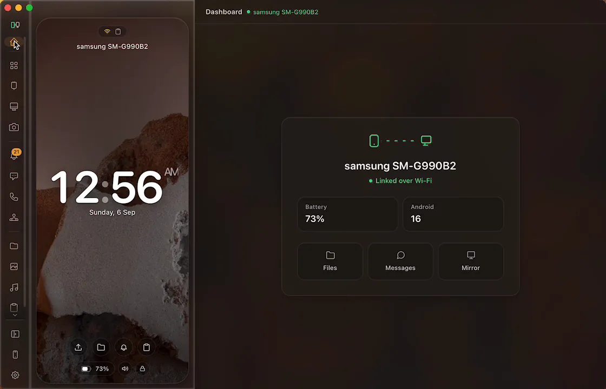
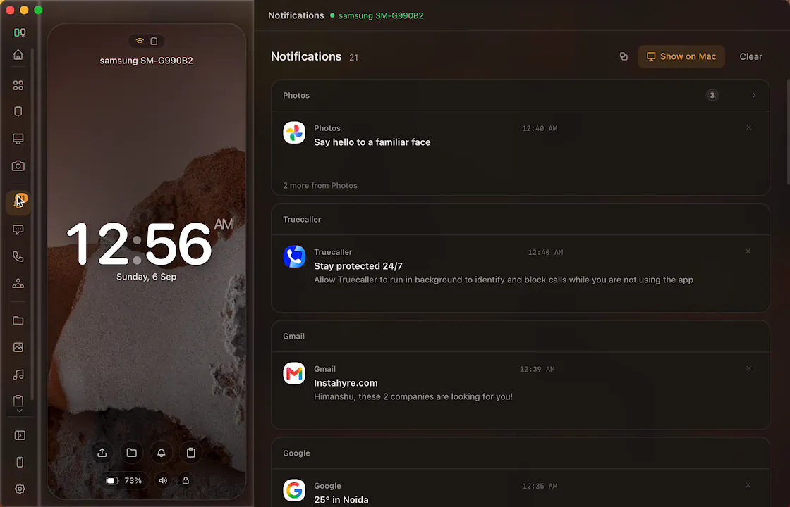
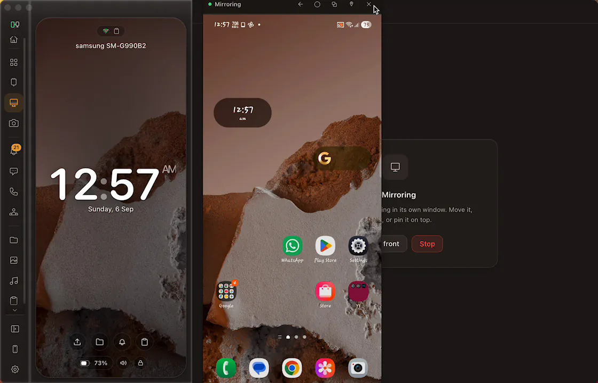
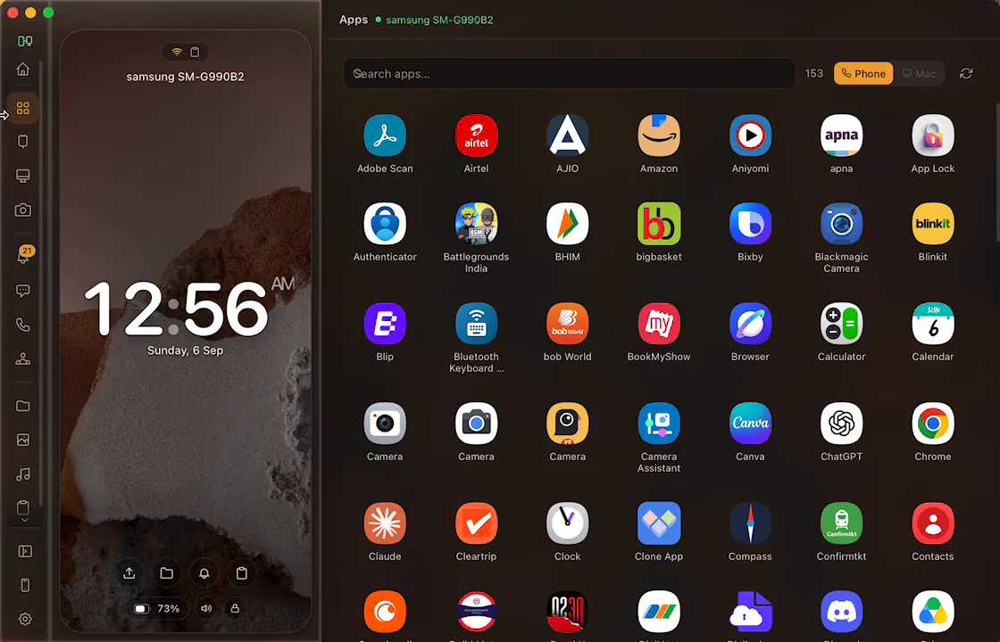
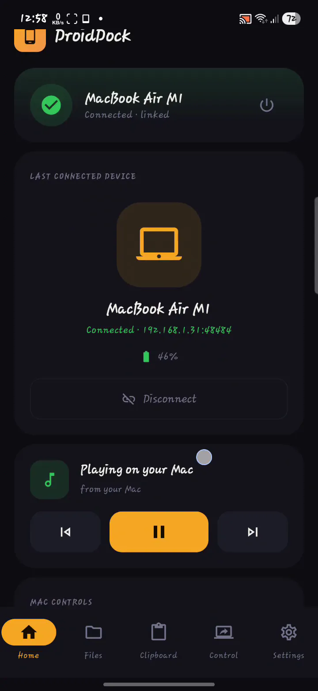
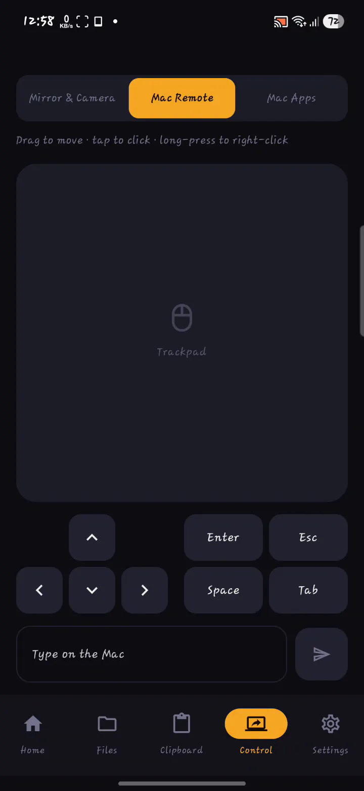
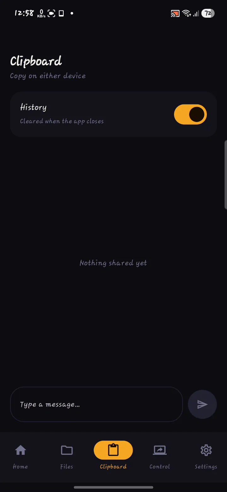
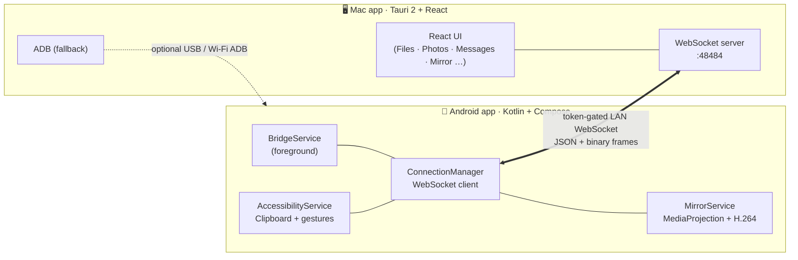

<div align="center">

# 🔗 DroidDock

### Your Android phone and your Mac, finally in sync.

Clipboard · notifications · files · photos · messages · calls · screen mirror · camera —
flowing seamlessly between your phone and your Mac over your local Wi‑Fi.

**Made with [Tauri 2](https://tauri.app)** — the Mac app is a native Rust binary in a
~6 MB `.dmg`, not a bundled browser. *(It was an Electron app until v1.0.0; that client
is retired and kept only as a protocol reference.)*


[](https://himanshudev28.github.io/DroidDockWebsite/)

**[See it in action → himanshudev28.github.io/DroidDockWebsite/](https://himanshudev28.github.io/DroidDockWebsite/)**

</div>

---

## ✨ What is this?

**DroidDock** is a personal **Android ↔ Mac bridge**. Pair your phone once with a QR code
and the two stay quietly connected on your network — so the things you do on one device
just show up on the other. Copy text on your phone and paste it on your Mac. Reply to a
text from your keyboard. Drag a file onto the Mac window and it lands on your phone.
Browse your gallery, mirror your screen, take a call — all from your desk.

It's two apps that talk to each other:

| | App | Built with |
|---|---|---|
| 🖥️ | **Mac client** — [`droiddock-tauri/`](droiddock-tauri/) | Tauri 2 · Rust · React · Tailwind |
| 📱 | **Android companion** — [`droiddock-android/`](droiddock-android/) | Kotlin · Jetpack Compose |

---

## 📸 Screenshots

<div align="center">

### 🖥️ On the Mac

<table>
<tr>
<td width="50%" align="center">
  
  <br><strong>Dashboard</strong><br><sub>The phone lives in the rail — battery, Android version, one tap to anything</sub>
</td>
<td width="50%" align="center">
  
  <br><strong>Notifications</strong><br><sub>Grouped by app, dismissible, with inline reply — or off with one toggle</sub>
</td>
</tr>
<tr>
<td width="50%" align="center">
  
  <br><strong>Screen mirror</strong><br><sub>Its own window — move it, resize it, pin it on top</sub>
</td>
<td width="50%" align="center">
  
  <br><strong>Apps</strong><br><sub>Every phone app, searchable, launched from your keyboard</sub>
</td>
</tr>
</table>

### 📱 On the phone

<table>
<tr>
<td width="33%" align="center">
  
  <br><strong>Home</strong><br><sub>Which Mac, how full its battery is, what it's playing</sub>
</td>
<td width="33%" align="center">
  
  <br><strong>Mac Remote</strong><br><sub>Trackpad, arrow keys, and a keyboard for the Mac</sub>
</td>
<td width="33%" align="center">
  
  <br><strong>Clipboard</strong><br><sub>Copy on either device — history optional, cleared on close</sub>
</td>
</tr>
</table>

<sub>More at <a href="https://himanshudev28.github.io/DroidDockWebsite/">himanshudev28.github.io/DroidDockWebsite</a></sub>

</div>

---

## 🚀 Features

| | Feature | What it does |
|:--:|---|---|
| 📋 | **Clipboard sync** | Mac → phone automatically; phone → Mac automatically or manually — **Auto / Manual** toggle. Works on Android 13+ / Samsung (uses accessibility events, not clipboard reads). **Images** cross too: Mac → phone automatically, phone → Mac from the tile, widget or share sheet. |
| 🔔 | **Notification mirroring** | Phone notifications on your Mac as native macOS alerts with **inline reply** and dismiss. Incoming calls shown with caller ID. |
| 📁 | **File transfer & browser** | Drag-and-drop both ways with live progress; browse, download, upload, **rename**, **delete** and **search** phone storage. Android Files tab shows an **upload queue** with real-time progress bar, transfer speed, and a **recent transfers** history with colored file-type badges. |
| 🖼️ | **Photos & Videos** | Browse thumbnails, open full-res in Preview / QuickTime, download originals. |
| 💬 | **Messages** | Polished 2-pane SMS chat — conversation list with avatar initials, search, day dividers, composer. Threads sync live. |
| 👤 | **Contacts** | Browse and search your phone's contacts. |
| 📞 | **Phone calls** | Place calls from the Mac, and **answer, decline, hang up, mute and switch to speaker** from it — over Wi-Fi, no ADB. Incoming-call alerts with caller ID. (Keypad tones stay ADB-only: Android only lets the default dialer send them.) |
| 🩺 | **Setup check** | One panel listing every permission both devices need, what breaks without each, and a Fix button that opens the exact settings screen — on either device. |
| 🔊 | **Ring my phone** | Find a phone down the back of the sofa. Plays on the alarm stream, so silent mode doesn't mute it; stops from the Mac, from its own notification, or after a minute. |
| 📸 | **Mirror stills & recordings** | Save a PNG of the phone screen, or record it to MP4, straight from the mirror window. |
| 🎵 | **Media remote** | Now-Playing card with transport + volume control. |
| 🪞 | **Screen mirroring** | Mirror **and control** your phone over Wi-Fi (MediaProjection + H.264) — tap, swipe, scroll, type and use the nav bar from your Mac. Pops out into a phone-shaped, always-on-top window. **No ADB, no scrcpy, no Developer Options.** |
| 📷 | **Phone camera** | Use your phone's back or front camera as a Mac webcam-style feed — live, switchable, no ADB. |
| 📲 | **Apps grid** | Your phone's app drawer on the Mac, with real icons, prefix-ranked search and pinning. Click an app to launch it **on the phone** or **in its own Mac window** — a switch in the grid's header (and Settings → Mirroring) picks which, and holding **⌥ Option** always does the other one. |
| 🤖 | **Auto Mirror mode** | Grant "Display over other apps" once — after that the Mac can start screen/camera instantly with no per-session tap on the phone. |
| 🔌 | **Smart pairing** | **Custom QR scan screen** (glowing amber corner brackets, animated status pill) or manual IP entry; auto-reconnect; "Forget this Mac"; **Pause** mode (1h / 8h / until resume). |
| 🖥️ | **Your Mac, on your phone** | The phone's Home screen shows the Mac's **name, battery and charging state**, plus what it's playing — with working transport keys, **volume**, **brightness**, **screensaver** and **lock**. Off unless you enable remote control. |
| 🌗 | **Light & dark themes** | Both apps follow the system theme or pin one, with a warm palette and adjustable glass on the Mac. The Android light palette is contrast-measured, not eyeballed. |
| ⬆️ | **Self-updating** | The Mac app updates in place; the Android APK is signed with a stable release key so it can too. |
| 📱 | **Device management** | Remembered Macs, Quick Connect, Disconnect, and switching between Macs — discovered over mDNS. |
| 📜 | **Clipboard history** | This session's clips, both directions. Memory-only and capped on purpose — persisting it would be a plaintext log of passwords and OTPs. |
| ⚡ | **Quick Settings tiles** | Toggle the connection and the accessibility service straight from the Android shade. |

---

## 🎨 Design

### Mac app — Apple HIG + Liquid Glass

The Mac client follows **Apple Human Interface Guidelines** and the latest **Liquid Glass**
design language:

- Deep graphite palette (`#0D0D12` ink, `#14141B` panels) with Geist + JetBrains Mono typography
- Glassmorphism toasts and modals with `backdrop-filter: blur(20px)` and translucent tints
- Layered depth via inner-highlight box shadows and elevation classes (`.luminous`, `.float-md`)
- Traffic-light drag region with `hiddenInset` title bar; amber LED status indicator
- Spring-animated tab indicator, content-first layout, macOS-native thin scrollbar

### Android app — Material Design 3

The Android companion follows **Material Design 3** throughout:

- Same graphite palette aligned with the Mac — `#0D0D12` ink, `#F5A623` amber, `#34C759` green
- All-vector icons from **Material Icons Extended** — zero emoji anywhere in the UI
- Animated connection hero card with `AnimatedContent` transitions and ambient gradient glow
- MD3 `Switch`, `Card`, `Button`, `AlertDialog`, `FilledTonalButton`, `Surface` — native look and feel
- Collapsible feature guide with `AnimatedVisibility` step lists
- Amber scan-to-connect screen with glowing corner brackets and pulsing green dot

---

## 🧠 How it works

The apps speak over a **token-gated WebSocket on your LAN** — request/response messages
keyed by `reqId`, plus a compact binary frame protocol for file, thumbnail and video
transfers. Screen capture uses **MediaProjection + MediaCodec H.264** on the phone;
the Mac decodes with the browser's **WebCodecs VideoDecoder** and paints to a canvas.
Touch/input is injected back through the **AccessibilityService**.



Pair once — they auto-reconnect whenever both apps are open on the same network.

---

## ⬇️ Install (the easy way — no build tools)

Grab the prebuilt apps from the [**Releases**](../../releases) page:

1. **Mac** — download `DroidDock_<version>_aarch64.dmg` (Apple Silicon), open it and
   drag **DroidDock.app** to Applications. Then **right-click the app → Open** →
   **Open** for the first launch only.

   > The app is ad-hoc signed, not notarized (that needs a paid Apple Developer
   > account), so macOS won't run it straight from a double-click. If right-click →
   > Open doesn't offer you an **Open** button, clear the download flag instead:
   >
   > ```
   > xattr -dr com.apple.quarantine /Applications/DroidDock.app
   > ```
2. **Android** — download `DroidDock-Android.apk` and sideload it (allow "install unknown apps").
3. Open the Mac app → **Pair Device** → scan the QR with the phone app. Done.

> ⬆️ **Both apps update themselves from v2.0.0 onward** — the Mac in place, and the
> Android APK too, now that it ships signed with a stable release key.
>
> ⚠️ **Upgrading from v1.0.0 or earlier needs one manual uninstall + reinstall of the
> Android app.** Releases up to v1.0.0 shipped a *debug-signed* APK whose key changed
> every build, and Android refuses to replace an APK with one signed by a different
> certificate. This is a one-time break.

> ✅ **No ADB, no scrcpy, no Developer Options needed** — including for **screen
> mirroring and phone camera**. Everything runs over the Wi-Fi app link. `adb` is
> still auto-downloaded the first time it's needed as an optional power-user tool.

### 📺 Screen mirroring & phone camera

Tap **Screen** or **Camera** in the Mac's Mirror tab.

- **Normal mode** — a notification appears on the phone; tap it to approve the
  one-time "Allow screen capture" prompt. The phone screen pops out into a
  phone-shaped always-on-top Mac window. Tap, swipe, scroll, type and use the
  nav bar from your Mac keyboard and mouse.
- **Auto mode** (recommended) — grant "Display over other apps" once in the Android
  app's settings. After that the capture dialog pops up directly with no notification
  tap, and camera starts instantly. Stopping from the Mac clears the phone's cast
  indicator completely.

### 📲 Opening phone apps

The **Apps** tab lists every launchable app on the phone. Click one and it opens
in one of two places:

- **On the phone** (the default) — the app launches on the handset, ready to be
  watched from the Mirror tab.
- **On this Mac** — the app opens in its own Mac window on a virtual Android
  display, and the phone's own screen is left untouched. Needs ADB and scrcpy;
  with no ADB device connected the click falls back to launching on the phone
  rather than doing nothing.

Pick the default with the **Phone / Mac** switch in the Apps header, or
**Settings → Mirroring → Open apps on this Mac** — they are the same setting.
Holding **⌥ Option** while clicking always does whichever one is *not* the
default, so both are always one modifier away.

How that Mac window looks is governed by the rest of **Settings → Mirroring**:
*Window layout* decides whether Android serves a desktop or a magnified-phone
layout, *Show Android bars* keeps or drops the launcher/status/nav bars, and
*Keep apps running when the window closes* hands the app back to the phone
instead of killing it.

### 🔔 Mac notifications

Phone notifications appear as native macOS alerts. To enable:

1. Open DroidDock on both devices and connect.
2. Grant **Notification Access** in the Android app.
3. On macOS, go to **System Settings → Notifications → DroidDock** and enable Allow Notifications.

---

## 🧑‍💻 Build from source

Needs [Rust](https://rustup.rs) (stable) and Node 22+ for the Mac app, JDK 17 for Android.

```bash
# Mac app  (Tauri 2 — Rust backend + React frontend)
cd droiddock-tauri/app
npm install
npm run tauri dev      # dev build, hot-reloads the frontend
npm run tauri build    # .app + .dmg → src-tauri/target/release/bundle/

# Android app
cd droiddock-android
./gradlew installDebug   # or open in Android Studio → Run
```

> 💡 The first `npm run tauri dev` compiles the whole Rust dependency tree and
> takes a few minutes. Later runs are incremental. If the app starts but no
> phone can connect, check nothing else is holding port `48484` — a second copy
> of DroidDock will do it.

Releases are built automatically by
[`.github/workflows/release.yml`](.github/workflows/release.yml) — push a tag
(`git tag v1.0.0 && git push origin v1.0.0`) and the `.dmg` + `.apk` are built
and attached to a GitHub Release. The version in the artifact filenames comes
from `droiddock-tauri/app/src-tauri/tauri.conf.json`, so bump that to match the
tag before releasing.

### First-run Android permissions

Grant these when the app asks (they're all needed for the full feature set):

| Permission | Feature |
|---|---|
| Notification access | Mirrors phone notifications to Mac |
| SMS · Contacts · Calls | Messages, contacts, call alerts |
| All-files access | File browser and transfer |
| Accessibility service ("Clipboard & Screen Control") | Auto clipboard phone → Mac **and every Mac-side tap, swipe and nav button** |
| Display over other apps | Auto Mirror mode (no per-session prompt) |
| Battery — Unrestricted | Keeps the link alive when screen is off |

> ⚠️ **Android 13+ blocks the accessibility toggle for sideloaded apps.** If
> "Clipboard & Screen Control" won't turn on (or switches itself back off), go to
> **Settings → Apps → DroidDock → ⋮ → Allow restricted settings** first, then enable
> it under **Settings → Accessibility → Installed apps**.
>
> **Reinstalling the APK turns it off again** — so re-enable it after every update.
> With it off, the mirror still streams video but every tap, swipe and nav press
> from the Mac is silently discarded; the Mac now shows a toast telling you so.

---

## 🔐 Pairing

1. Put the Mac and phone on the **same Wi-Fi network**.
2. On the **Mac**, open **Pair Device** — it shows a QR code and the manual IP/token.
3. On the **phone**, tap **Pair with Mac** — the custom scan screen opens:
   - Point your camera at the QR on the Mac → paired instantly.
   - Or tap **Pair Manually** and type the IP + token the Mac shows.

They auto-reconnect from then on. Use **Pause** from the phone (power icon) to stop
reconnect attempts for 1h / 8h / indefinitely without unpairing.

---

## 🗂️ Project structure

```
DroidDock/
├─ droiddock-tauri/           🖥️  Mac app  (Tauri 2 · Rust + React)
│  ├─ app/src-tauri/src/      ·  ws_server · transfer · adb · mirror · tray
│  ├─ app/src/                ·  React UI + all components
│  └─ tools/fake_mac.py       ·  test harness: drives Mac→phone messages
├─ droiddock-android/         📱  Android app  (Kotlin + Compose)
│  └─ app/src/main/java/      ·  services · repos · Compose screens
├─ droiddock 2/               🗄️  retired Electron client — kept read-only as
│                             ·  the protocol reference the rewrite matches
├─ .github/workflows/         ·  CI release workflow
└─ README.md
```

---

## ⚠️ Notes & limitations

- The LAN link is a WebSocket gated by a pairing token — fine for a trusted home
  network. **Optional AES-256-GCM** (off by default, Settings → Security) encrypts
  JSON control messages, keyed off the pairing token. **Scope, stated plainly:**
  binary frames — file chunks, thumbnails, app icons, mirror video — stay in the
  clear, because wrapping them means surgery on the hot transfer/mirror loops.
  This is *not* end-to-end encryption of everything, and nothing in the UI claims
  it is. Full TLS is still a future enhancement.
- **Updating the Mac app revokes its Accessibility permission**, and macOS does not
  tell you. Because DroidDock is ad-hoc signed rather than Developer ID signed, the
  permission is recorded against a hash of the exact app binary
  (`designated => cdhash H"…"`), and every release is a different binary. The row
  stays in **Privacy & Security → Accessibility** with the switch still on, but the
  Mac ignores every remote click and keystroke. Fix it with **Settings → System →
  Reset permission** in DroidDock, then tick DroidDock when macOS asks. Unticking
  and re-ticking the stale row often doesn't help — it's the row itself that's dead.
  A Developer ID signature is the only thing that removes this for good.
- **Only one copy of DroidDock can run at a time** — they compete for port `48484`,
  and the loser can never accept a phone. The app now says so instead of looking
  healthy and doing nothing.
- **Android 13+ / Samsung One UI block background clipboard reads.** Phone → Mac
  auto-clipboard uses the accessibility service to read copied text from
  accessibility events the moment a "copied" toast fires — no clipboard read required.
- Screen mirroring uses **MediaProjection**: the phone asks for a one-time "Allow
  screen capture" consent each session (Android OS requirement). **Auto mode**
  works around this by keeping the system dialog visible without a notification tap
  — and reusing the projection across Mac reconnects where possible.
- Stopping mirroring from the Mac (closing the window or clicking STOP) fully stops
  the Android foreground service — the phone's cast/screen-share indicator clears
  immediately.

---

## 🧭 Roadmap

- [x] Wi-Fi app link — clipboard / notifications / messages / files / photos, no ADB
- [x] `adb` auto-downloads on first run (no manual platform-tools install)
- [x] One-click scrcpy install via Homebrew
- [x] Prebuilt `.app` + `.apk` via CI on each tag
- [x] Screen mirroring over the app link (MediaProjection + H.264, no ADB/scrcpy)
- [x] Touch/keyboard/nav control injection via AccessibilityService
- [x] Phone camera over the app link (front/back, no ADB)
- [x] Pop-out phone-shaped mirror window (always-on-top, scrcpy-style)
- [x] Auto Mirror mode — no per-session prompt with overlay permission
- [x] Custom QR scan screen with glowing corner brackets
- [x] Polished Messages UI — 2-pane chat with avatars, search, day dividers
- [x] Native macOS notifications with inline reply + incoming call alerts
- [x] **Mac UI redesign** — Apple HIG + Liquid Glass (glassmorphism, Geist font, layered depth)
- [x] **Android UI redesign** — Material Design 3 (all-vector icons, MD3 components, dynamic palette)
- [x] **Phone → Mac file transfer** — send files from the Android app directly to Mac Downloads with live amber progress bar
- [x] **Android Files tab** — upload queue with real-time progress bars, transfer speed, percentage; recent transfers history with colored file-type badges and direction/time labels
- [x] **Mac client rewritten on Tauri 2** — Rust backend, ~6 MB `.dmg` instead of a
      bundled Chromium
- [x] **Phone card** — wallpaper backdrop, live clock, battery, album art, recent apps
- [x] **Apps grid** — every launchable app with real icons, prefix-ranked search,
      launch or open in its own Mac window
- [x] **Menu-bar panel** — battery / now-playing / notifications without opening the app
- [x] **Link quality probe** + mDNS discovery as a third reconnect fallback
- [x] **Opt-in AES-256-GCM** for JSON control messages (see Notes for scope)
- [x] **Desktop mode** — mirror a virtual Android display, phone stays usable
- [x] **Per-app notification muting**
- [x] **Mac status + Now Playing on the phone** — battery, charging, and real media
      transport keys that drive any Mac app
- [x] **Mac volume / brightness / screensaver / lock** from the phone
- [x] **Light & dark themes** on both apps (Android light palette contrast-measured)
- [x] **Self-updating** — in-app updater on Mac, release-signed APK on Android
- [x] **Device management** — remembered Macs, Quick Connect, switch, mDNS discovery
- [x] **Clipboard history**, session-only and capped
- [x] **Quick Settings tiles** for connection + accessibility
- [x] **Lock the phone from the Mac** (no unlock — Android exposes no such API)
- [x] Window-wide drag & drop, configurable mirror quality, Android unit tests in CI
- [ ] TLS on the LAN link
- [ ] Audio streaming (Mac ↔ phone)

---

## 🤝 Collaborate

Got a feature idea, a bug, or just want to make DroidDock better?
All suggestions and contributions are welcome — open an issue or a pull request on GitHub.

- **Feature request / idea** → [open an issue](../../issues/new) and describe what you'd like to see
- **Bug report** → [open an issue](../../issues/new) with steps to reproduce and your Android / macOS versions
- **Pull request** → fork the repo, make your change, and open a PR — even small fixes are appreciated

If you want to discuss a bigger idea before coding, just start a [discussion](../../discussions) or drop a comment in an issue.
Everyone who contributes gets credited in the release notes.

---

<div align="center">

**Built with ❤️ for a friction-free desk.**

</div>

---

## ☕ Support

<div align="center">

If DroidDock saves you time, a small tip keeps the ☕ flowing. 🙏

<br>

**Scan to pay — works with any UPI app**


`9120741461@ybl`

PhonePe · GPay · Paytm · BHIM · any UPI app

<br>

[](https://github.com/himanshudev28/MacDroid)
[](https://himanshudev28.github.io/DroidDockWebsite/)

</div>
