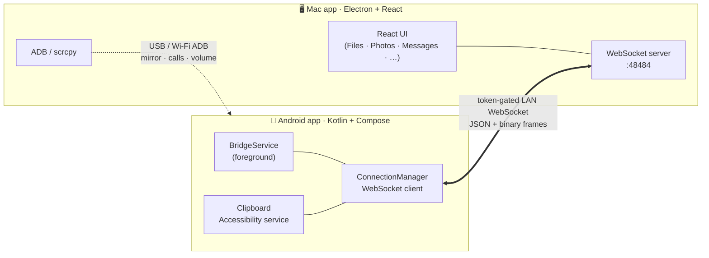

<div align="center">

# 🔗 DroidDock

### Your Android phone and your Mac, finally in sync.

Clipboard, notifications, files, photos, messages, calls and more — flowing seamlessly
between your phone and your Mac over your local Wi‑Fi.


</div>

---

## ✨ What is this?

**DroidDock** is a personal **Android ↔ Mac bridge**. Pair your phone with your Mac once,
and the two stay quietly connected on your network — so the things you do on one device
just show up on the other. Copy text on your phone and paste it on your Mac. Reply to a
text from your keyboard. Drag a file onto the Mac window and it lands on your phone.
Browse your gallery, mirror your screen, take a call — all from your desk.

It's two apps that talk to each other:

| | App | Built with |
|---|---|---|
| 🖥️ | **Mac client** — [`droiddock 2/`](droiddock%202/) | Electron · React · Tailwind |
| 📱 | **Android companion** — [`droiddock-android/`](droiddock-android/) | Kotlin · Jetpack Compose |

---

## 🚀 Features

| | Feature | What it does |
|:--:|---|---|
| 📋 | **Clipboard sync** | Mac → phone automatically; phone → Mac automatically (via the accessibility service) or manually — with an **Auto / Manual** toggle. |
| 🔔 | **Notification mirroring** | Phone notifications on your Mac, with **inline reply** and dismiss. |
| 📁 | **File transfer & browser** | Drag‑and‑drop both ways with live progress; browse, download, upload, **rename**, **delete** and **search** phone storage. |
| 🖼️ | **Photos & Videos** | Browse thumbnails, open full‑res in Preview/QuickTime, download originals. |
| 💬 | **Messages** | Read and **reply to SMS** from your Mac, threads sync live. |
| 👤 | **Contacts** | Browse and search your phone's contacts. |
| 📞 | **Phone calls** | Place calls from the Mac; incoming‑call alerts with caller ID. |
| 🎵 | **Media remote** | Now‑Playing card with transport + volume control. |
| 🪞 | **Screen mirroring** | Mirror **and control** your phone over the Wi‑Fi app link (MediaProjection + H.264) — tap, swipe, scroll, type and use the nav bar from your Mac. Pops out into a phone‑shaped, always‑on‑top window (scrcpy‑style). No ADB, no scrcpy, no Developer Options. |
| 📷 | **Phone camera** | Use your phone's camera as a Mac webcam‑style feed over the app link — front/back switch, no ADB. |
| 🔌 | **Smart pairing** | QR or manual IP, auto‑reconnect, "forget this Mac", and a **Pause** mode (1h / 8h / until you resume). |

---

## 🧠 How it works

The apps speak over a **token‑gated WebSocket on your LAN** — request/response messages
keyed by `reqId`, plus a compact binary frame protocol for file and thumbnail transfers.
ADB (and `scrcpy`) act as a second, faster transport for USB‑only features like screen
mirroring, call control and device volume.



Pair once with a QR code (or type the IP), and the two reconnect on their own whenever
they're both open on the same network.

---

## ⬇️ Install (the easy way — no build tools)

Grab the prebuilt apps from the [**Releases**](../../releases) page:

1. **Mac** — download `DroidDock-*-mac.zip`, unzip, drag **DroidDock.app** to Applications.
   *(It's unsigned, so the first launch is right‑click → Open.)*
2. **Android** — download `DroidDock.apk` and install it (allow "install unknown apps"
   when prompted).
3. Open the Mac app → **Pair Device** → scan the QR with the phone app. **Done** —
   clipboard, notifications, messages, contacts, calls, files and photos all work.

> ✅ **No ADB, no scrcpy, no Developer Options needed for anything** — including
> **screen mirroring and phone camera**. It's all over the Wi‑Fi app link. `adb` is
> still **auto‑installed** the first time it's needed as a power‑user fallback.

### 📺 Screen mirroring & phone camera — over the app link

Tap **Mirror Screen** on the Mac → accept the one‑time **"Allow screen capture"** prompt
on the phone → your phone screen pops out into a phone‑shaped, always‑on‑top window. You
can **tap, swipe, scroll, type and use the nav bar** from the Mac — input is injected
through the accessibility service. The phone camera works the same way over the link.

> 🛠️ The legacy `scrcpy` over ADB path is still bundled as a power‑user fallback. If
> `scrcpy` is missing the app shows a one‑click **Install with Homebrew** button.

---

## 🧑‍💻 Build from source (developers)

```bash
# Mac app
cd "droiddock 2" && npm install && npm run dev
#   packaged build:  npm run dist        (output in dist/)

# Android app  (Android Studio → Run, or:)
cd droiddock-android && ./gradlew installDebug
```

> 💡 If your terminal exports `ELECTRON_RUN_AS_NODE=1` (some IDE terminals do), Electron
> boots as plain Node and crashes with `electron.app … whenReady undefined`.
> Launch with `env -u ELECTRON_RUN_AS_NODE npm run dev`.

Releases are built automatically by [`.github/workflows/release.yml`](.github/workflows/release.yml) —
push a tag (`git tag v0.6.0 && git push origin v0.6.0`) and the `.app` + `.apk` are
built and attached to a GitHub Release.

On the Android app's first launch, grant the permissions it requests (Notification
access, SMS · Contacts · Calls, All‑files access). For automatic phone → Mac clipboard,
enable the **DroidDock Clipboard** accessibility service.

---

## 🔐 Pairing

1. Put the Mac and phone on the **same Wi‑Fi network**.
2. On the **Mac**, open **Pair Device** — it shows a QR code plus the manual IP/token.
3. On the **phone**, tap **Pair with Mac** and scan the QR, or choose **Enter IP manually**.

That's it — they auto‑reconnect from then on.

---

## 🗂️ Project structure

```
DroidDock/
├─ droiddock 2/            🖥️  Mac app  (Electron + React)
│  ├─ src/main/            ·  adb · wifi · transfer · main process
│  └─ src/renderer/        ·  React UI + components
├─ droiddock-android/      📱  Android app  (Kotlin + Compose)
│  └─ app/src/main/        ·  services, repos, Compose UI
├─ img/  ·  img_featureGuide/  ·  LinkMyDriod MAcApp/   🎨  UI/UX reference screenshots
└─ README.md
```

> The screenshot folders are **design references** used for feature parity — the visual
> language the apps were modelled after, not shots of the build itself.

---

## ⚠️ Notes & limitations

- The LAN link is a plain WebSocket gated by a pairing token — perfect for a trusted home
  network; TLS is a future enhancement.
- **Android 13+ / Samsung One UI block background clipboard reads for every app.** So
  phone → Mac auto‑clipboard is done through the accessibility service: it reads the
  copied text straight from accessibility events and sends it the moment a "copied" toast
  confirms a real copy — no clipboard access required.
- Screen mirroring & remote input run over the app link using **MediaProjection** (one
  on‑phone "Allow screen capture" tap) — no ADB or Developer Options needed. The
  `scrcpy`‑over‑ADB path remains as an optional power‑user fallback.

---

## 🧭 Roadmap

Toward a **zero‑setup** experience — install the two apps, scan a QR, done:

- [x] Wi‑Fi app link covers clipboard / notifications / messages / files / photos with no ADB
- [x] `adb` **auto‑downloads** on first run (no manual platform‑tools install)
- [x] One‑click **scrcpy install** via Homebrew from the Setup modal
- [x] Prebuilt **`.app` + `.apk`** published by CI on each tag
- [x] **Screen mirroring over the app link via MediaProjection** — the Android app captures
      its own screen (MediaCodec H.264) and streams it to the Mac over the existing
      WebSocket; control (tap / swipe / scroll / nav) is injected back through the
      accessibility service. **No ADB, no scrcpy, no Developer Options.** The legacy
      ADB/scrcpy path stays as a power‑user fallback.
- [x] **Phone camera over the app link** — front/back camera streamed to the Mac with no ADB
- [x] **Pop‑out, phone‑shaped mirror window** (always‑on‑top, scrcpy‑style)
- [ ] TLS on the LAN link (currently a token‑gated plain WebSocket)
- [ ] Audio streaming (Mac ↔ phone)

---

<div align="center">

**Built with ❤️ for a friction‑free desk.**

</div>
