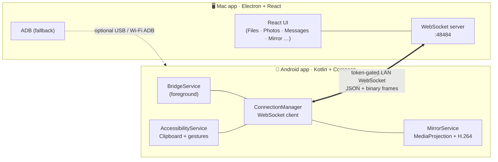

<div align="center">

# 🔗 DroidDock

### Your Android phone and your Mac, finally in sync.

Clipboard · notifications · files · photos · messages · calls · screen mirror · camera —
flowing seamlessly between your phone and your Mac over your local Wi‑Fi.


</div>

---

## ✨ What is this?

**DroidDock** is a personal **Android ↔ Mac bridge**. Pair your phone once with a QR code
and the two stay quietly connected on your network — so the things you do on one device
just show up on the other. Copy text on your phone and paste it on your Mac. Reply to a
text from your keyboard. Drag a file onto the Mac window and it lands on your phone.
Browse your gallery, mirror your screen, take a call — all from your desk.

It's two apps that talk to each other:

| | App | Built with |
|---|---|---|
| 🖥️ | **Mac client** — [`droiddock 2/`](droiddock%202/) | Electron · React · Tailwind |
| 📱 | **Android companion** — [`droiddock-android/`](droiddock-android/) | Kotlin · Jetpack Compose |

---

## 🚀 Features

| | Feature | What it does |
|:--:|---|---|
| 📋 | **Clipboard sync** | Mac → phone automatically; phone → Mac automatically or manually — **Auto / Manual** toggle. Works on Android 13+ / Samsung (uses accessibility events, not clipboard reads). |
| 🔔 | **Notification mirroring** | Phone notifications on your Mac as native macOS alerts with **inline reply** and dismiss. Incoming calls shown with caller ID. |
| 📁 | **File transfer & browser** | Drag-and-drop both ways with live progress; browse, download, upload, **rename**, **delete** and **search** phone storage. |
| 🖼️ | **Photos & Videos** | Browse thumbnails, open full-res in Preview / QuickTime, download originals. |
| 💬 | **Messages** | Polished 2-pane SMS chat — conversation list with avatar initials, search, day dividers, composer. Threads sync live. |
| 👤 | **Contacts** | Browse and search your phone's contacts. |
| 📞 | **Phone calls** | Place calls from the Mac; incoming-call alerts with caller ID. |
| 🎵 | **Media remote** | Now-Playing card with transport + volume control. |
| 🪞 | **Screen mirroring** | Mirror **and control** your phone over Wi-Fi (MediaProjection + H.264) — tap, swipe, scroll, type and use the nav bar from your Mac. Pops out into a phone-shaped, always-on-top window. **No ADB, no scrcpy, no Developer Options.** |
| 📷 | **Phone camera** | Use your phone's back or front camera as a Mac webcam-style feed — live, switchable, no ADB. |
| 🤖 | **Auto Mirror mode** | Grant "Display over other apps" once — after that the Mac can start screen/camera instantly with no per-session tap on the phone. |
| 🔌 | **Smart pairing** | **Custom QR scan screen** (glowing amber corner brackets, animated status pill) or manual IP entry; auto-reconnect; "Forget this Mac"; **Pause** mode (1h / 8h / until resume). |

---

## 🎨 Design

### Mac app — Apple HIG + Liquid Glass

The Mac client follows **Apple Human Interface Guidelines** and the latest **Liquid Glass**
design language:

- Deep graphite palette (`#0D0D12` ink, `#14141B` panels) with Geist + JetBrains Mono typography
- Glassmorphism toasts and modals with `backdrop-filter: blur(20px)` and translucent tints
- Layered depth via inner-highlight box shadows and elevation classes (`.luminous`, `.float-md`)
- Traffic-light drag region with `hiddenInset` title bar; amber LED status indicator
- Spring-animated tab indicator, content-first layout, macOS-native thin scrollbar

### Android app — Material Design 3

The Android companion follows **Material Design 3** throughout:

- Same graphite palette aligned with the Mac — `#0D0D12` ink, `#F5A623` amber, `#34C759` green
- All-vector icons from **Material Icons Extended** — zero emoji anywhere in the UI
- Animated connection hero card with `AnimatedContent` transitions and ambient gradient glow
- MD3 `Switch`, `Card`, `Button`, `AlertDialog`, `FilledTonalButton`, `Surface` — native look and feel
- Collapsible feature guide with `AnimatedVisibility` step lists
- Amber scan-to-connect screen with glowing corner brackets and pulsing green dot

---

## 🧠 How it works

The apps speak over a **token-gated WebSocket on your LAN** — request/response messages
keyed by `reqId`, plus a compact binary frame protocol for file, thumbnail and video
transfers. Screen capture uses **MediaProjection + MediaCodec H.264** on the phone;
the Mac decodes with the browser's **WebCodecs VideoDecoder** and paints to a canvas.
Touch/input is injected back through the **AccessibilityService**.



Pair once — they auto-reconnect whenever both apps are open on the same network.

---

## ⬇️ Install (the easy way — no build tools)

Grab the prebuilt apps from the [**Releases**](../../releases) page:

1. **Mac** — download `DroidDock-*-mac.zip`, unzip, drag **DroidDock.app** to Applications.
   *(Unsigned: first launch is right-click → Open.)*
2. **Android** — download `DroidDock.apk` and sideload it (allow "install unknown apps").
3. Open the Mac app → **Pair Device** → scan the QR with the phone app. Done.

> ✅ **No ADB, no scrcpy, no Developer Options needed** — including for **screen
> mirroring and phone camera**. Everything runs over the Wi-Fi app link. `adb` is
> still auto-downloaded the first time it's needed as an optional power-user tool.

### 📺 Screen mirroring & phone camera

Tap **Screen** or **Camera** in the Mac's Mirror tab.

- **Normal mode** — a notification appears on the phone; tap it to approve the
  one-time "Allow screen capture" prompt. The phone screen pops out into a
  phone-shaped always-on-top Mac window. Tap, swipe, scroll, type and use the
  nav bar from your Mac keyboard and mouse.
- **Auto mode** (recommended) — grant "Display over other apps" once in the Android
  app's settings. After that the capture dialog pops up directly with no notification
  tap, and camera starts instantly. Stopping from the Mac clears the phone's cast
  indicator completely.

### 🔔 Mac notifications

Phone notifications appear as native macOS alerts. To enable:

1. Open DroidDock on both devices and connect.
2. Grant **Notification Access** in the Android app.
3. On macOS, go to **System Settings → Notifications → DroidDock** and enable Allow Notifications.

---

## 🧑‍💻 Build from source

```bash
# Mac app
cd "droiddock 2"
npm install
npm run dev          # dev server + Electron
npm run dist         # packaged .app → dist/

# Android app
cd droiddock-android
./gradlew installDebug   # or open in Android Studio → Run
```

> 💡 If your terminal exports `ELECTRON_RUN_AS_NODE=1` (some IDE setups do), Electron
> boots as plain Node and crashes. Launch with:
> `env -u ELECTRON_RUN_AS_NODE npm run dev`

Releases are built automatically by
[`.github/workflows/release.yml`](.github/workflows/release.yml) — push a tag
(`git tag v0.7.0 && git push origin v0.7.0`) and the `.app` + `.apk` are
built and attached to a GitHub Release.

### First-run Android permissions

Grant these when the app asks (they're all needed for the full feature set):

| Permission | Feature |
|---|---|
| Notification access | Mirrors phone notifications to Mac |
| SMS · Contacts · Calls | Messages, contacts, call alerts |
| All-files access | File browser and transfer |
| Accessibility service ("DroidDock Clipboard") | Auto clipboard phone → Mac |
| Display over other apps | Auto Mirror mode (no per-session prompt) |
| Battery — Unrestricted | Keeps the link alive when screen is off |

---

## 🔐 Pairing

1. Put the Mac and phone on the **same Wi-Fi network**.
2. On the **Mac**, open **Pair Device** — it shows a QR code and the manual IP/token.
3. On the **phone**, tap **Pair with Mac** — the custom scan screen opens:
   - Point your camera at the QR on the Mac → paired instantly.
   - Or tap **Pair Manually** and type the IP + token the Mac shows.

They auto-reconnect from then on. Use **Pause** from the phone (power icon) to stop
reconnect attempts for 1h / 8h / indefinitely without unpairing.

---

## 🗂️ Project structure

```
DroidDock/
├─ droiddock 2/               🖥️  Mac app  (Electron + React)
│  ├─ src/main/               ·  adb · wifi · transfer · main process
│  └─ src/renderer/src/       ·  React UI + all components
├─ droiddock-android/         📱  Android app  (Kotlin + Compose)
│  └─ app/src/main/java/      ·  services · repos · Compose screens
├─ .github/workflows/         ·  CI release workflow
└─ README.md
```

---

## ⚠️ Notes & limitations

- The LAN link is a plain WebSocket gated by a pairing token — fine for a trusted
  home network. TLS is a future enhancement.
- **Android 13+ / Samsung One UI block background clipboard reads.** Phone → Mac
  auto-clipboard uses the accessibility service to read copied text from
  accessibility events the moment a "copied" toast fires — no clipboard read required.
- Screen mirroring uses **MediaProjection**: the phone asks for a one-time "Allow
  screen capture" consent each session (Android OS requirement). **Auto mode**
  works around this by keeping the system dialog visible without a notification tap
  — and reusing the projection across Mac reconnects where possible.
- Stopping mirroring from the Mac (closing the window or clicking STOP) fully stops
  the Android foreground service — the phone's cast/screen-share indicator clears
  immediately.

---

## 🧭 Roadmap

- [x] Wi-Fi app link — clipboard / notifications / messages / files / photos, no ADB
- [x] `adb` auto-downloads on first run (no manual platform-tools install)
- [x] One-click scrcpy install via Homebrew
- [x] Prebuilt `.app` + `.apk` via CI on each tag
- [x] Screen mirroring over the app link (MediaProjection + H.264, no ADB/scrcpy)
- [x] Touch/keyboard/nav control injection via AccessibilityService
- [x] Phone camera over the app link (front/back, no ADB)
- [x] Pop-out phone-shaped mirror window (always-on-top, scrcpy-style)
- [x] Auto Mirror mode — no per-session prompt with overlay permission
- [x] Custom QR scan screen with glowing corner brackets
- [x] Polished Messages UI — 2-pane chat with avatars, search, day dividers
- [x] Native macOS notifications with inline reply + incoming call alerts
- [x] **Mac UI redesign** — Apple HIG + Liquid Glass (glassmorphism, Geist font, layered depth)
- [x] **Android UI redesign** — Material Design 3 (all-vector icons, MD3 components, dynamic palette)
- [ ] TLS on the LAN link
- [ ] Audio streaming (Mac ↔ phone)

---

<div align="center">

**Built with ❤️ for a friction-free desk.**

</div>

---

## ☕ Support

<div align="center">

If DroidDock saves you time and you'd like to say thanks — every coffee counts. ✨

<br>

[](https://ko-fi.com)
&nbsp;&nbsp;
[](https://github.com/himanshudev28/MacDroid)

<br>

**Pay directly via UPI** _(India)_

```
9120741461@ybl
```

> Open any UPI app (PhonePe · GPay · Paytm · BHIM) → Send to `9120741461@ybl`

<br>

_Ko-fi supports India — create a free page at [ko-fi.com](https://ko-fi.com) and update the badge link above._

</div>
